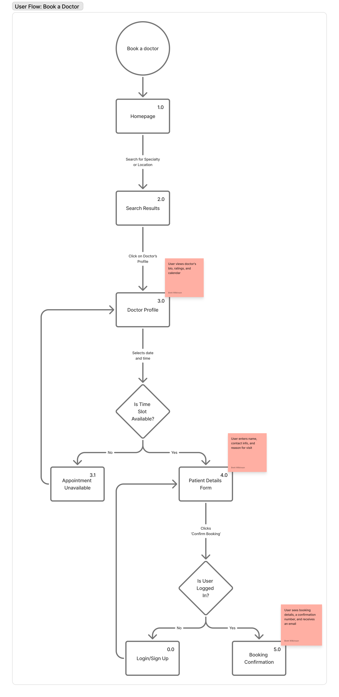

# Tutorial 03

This tutorial (held in Week 04) will look at defining maps in Figma.  Any remaining time in the tutorial should be used to work with your team on finalising your first assignment. 

Typically, the tutorials will be broken into distinct tasks where you are encouraged to either work in small groups or discuss the material openly with the wider tutorial class.  Where applicable, the tutorial tasks will relate directly to your assignment development.  Engagement with this process will assist your understanding of the assignment requirements and may contribute toward the deliverables.

## Task 01

A user flow is a visual representation of the path a user takes to complete a specific task.  For UX designers, it is an essential tool for identifying potential friction points, ensureing a logical user journey, and communicating design vision to stakeholders.

For our user flow maps we will use the following fundamental components:
- Shapes: represent different stages or actions.
  - Rectangles:  Typically represent a screen or page
  - Circles: Represent a starting point or end point of the flow.
  - Diamonds: Indicate a decision point where the user's path can bracnch based on a choice or a system condition.
- Connectors (Arrows): Lines that link shapes together, showing the direction and sequence of the user's journey.
- Text/Labels: Provide context and detail within the shapes and on the connectors

### Set up your FigJam board

Go to your project space that you and your team created last week.  Click the `+ Create` button and select FigJam.  Name your new board **User Flow Maps**.

## Task 02

The task that we are going to map will be the process of a website user booking a new appointment with a doctor.  The user is a new or returning patient who needs to find a suitable doctor and book a specific time slot.  The goal is to map the entire process from the user's perspective, including:
- Searching for a specialty area or a doctor.
- Viewing doctor profiles and availabilities,
- Selecting a time and date.
- Providing personal details.
- Confirming the booking.
- Receiving a confirmation email or message.

### Map the Core Flow (i.e., The "Happy Path")

We should start by mapping the most strightforward and successful path, also referred to as the "happy path".
1. Creating a canvas
    - From the toolbar at the bottom of the screen, select the Section item.
    - Drag a section on the screen so that it covers most of the available space (if necessary, we can expand this later).
    - Name the section "User Flow: Book a Doctor"
2. Starting point
    - From the toolbar at the bottom of the screen, select the Shapes icon.
    - Choose the Cirlce shape and place it on the board.
    - If necessary, double-click inside the shape to edit the label, write "Book a Doctor"
3. Add a page
    - Click on the Book a Doctor circle to select it - note the connector dots that appear around the shape.
    - Click and drag from the bottom connector dot.
    - Release the drag and select a Rectangle from the palette that appears.
    - Set the text label of the Rectangle to "Homepage".
    - From the toolbar select the Text item.
    - Add a text box to the top right of the Homepage rectangle.
    - Set the text label to "1.0".
4. Search Results
    - Click on the Homepage rectangle to select it and then left click on the bottom connector dot.  This will create a new Rectangle connected to our Homepage.
    - Set the text in the new Rectangle to "Search Results".
    - Add a Text box with the label "2.0".
    - Click on the Connector between Homepage and Search Results.
    - Double click on the highlight in the middle of the Connector to add a text label to the arrow.
    - Set the text on the Connector to: "Search for Specialty or Doctor"
    - Use Enter to add new lines in the label if it will not fit on the Connector.
5. Selecting a Doctor
    - Drag from the Search Results rectangle to add a new rectangle.
    - Set the label of the new rectangle to "Doctor Profile".
    - Set the label of the connector to "Clicks on doctor profile"
    - Attach a Sticky Note to the Doctor Profile page and add the following description: "User views doctor's bio, ratings, and calendar".
6. Booking the Appointment
    - Add another rectangle connected to the Doctor Profile page.
    - Name the rectangle "Patient Details Form".
    - Set the label on the connector to "Selects date and time"
    - Add a Sticky Note to the Patient Details Form with the following description: "User enters name, contact info, and reason for visit".
7. Final Confirmation
    - Connect a new Rectangle to the Patient Details Form.
    - Name the Rectangle "Booking Confimation"
    - Label the connector "Clicks 'Confirm Booking'"
    - Add a sticky note: "User sees booking details, a confirmation number, and receives an email".

## Task 03

We will now add some branches and complexity to our map.  This will require us to either delete or redirect some of our existing content.
1. Decision 1: Is a Time Slot Available?
    - Move Patient Details Form further away from Doctor Profile - give yourself some room to work.
    - Add a Diamond shape after the Doctor Profile form.
    - Set the label on the Diamond to: "Is Time Slot Available?".
    - Click on the Select date and time connector to select it.
    - Click and drag the end of the connector connected to Patient Details Form and attach it to the new Diamond you just added.
    - Drag a connector from the Diamond to Patient Details Form.
    - Set the label of the new connector to "Yes".
    - Drag a second connector from the Diamond and connect this to a new Rectangle.
    - Label the connector to the new Rectangle "No".
    - Set the label on the new Rectangle to "Appointment Unavailable".
    - Drag a connector from this rectangle back to the Doctor Profile rectangle.
2. Decision: Is the User Logged In?
    - Repeat the above process but add a decision diamond after the Patient Details Form.
    - If the patient is logged in, proceed to Booking Confirmation.
    - If the patient is not logged in, add a new page "Login/Sign Up" and a return connector back to Patient Details Form.
    - Make sure the connectors are labelled with a suitable response to the decision presented in the diamond.

The completed user flow map should look something like the following.
   

       
Book a Doctor - User Flow

       
   

The same mapping techniques can be used for the site map diagrams to be created.

## Task 04 - Websiite Wireframe

For this task you will use Figma Design to create a wireframe of a simple web page.

1. Return to the main Project page of your Figma project (if you are in FigJam, click the Figma F menu in the top left corner and select Back to files).
2. Click the + Create button and select the Design option.
3. When the workspace opens up, click on the Frame button in the Toolbar at the bottom of the screen.
4. In the right panel expand the Desktop option if necessary and select Desktop from the list.  You will now have a 1440 x 1024 workspace to build out your webpage wireframe.
5. Click on the Assets tab in the left panel.
6. Locate the Simple Design System UI Kit, and click on the + button that appears when you hover over it.
7. When the UI Kit has been added to your project click on the large Simple Design System button.  A palette of various widgets will open up for you to explore and use.

To add one of the widgets to your wireframe, you can either click, drag and drop it onto the wireframe canvas or click on the widget and select the Add Instance button.

Using the widgets in the SImple Design System as well as additional basic shapes as needed, you are to recreate the following sketch.  Think about the layout and the structure of the page, how would you iterate and modify its appearance, how would you update the format to map to existing models, is there anything missing from this instance?

   

       
Sample Wireframe Sketch

       
   

## Task 05 - Project Work

The rest of the tutorial should be spent working with your team toward the completion of the assignment requirements.