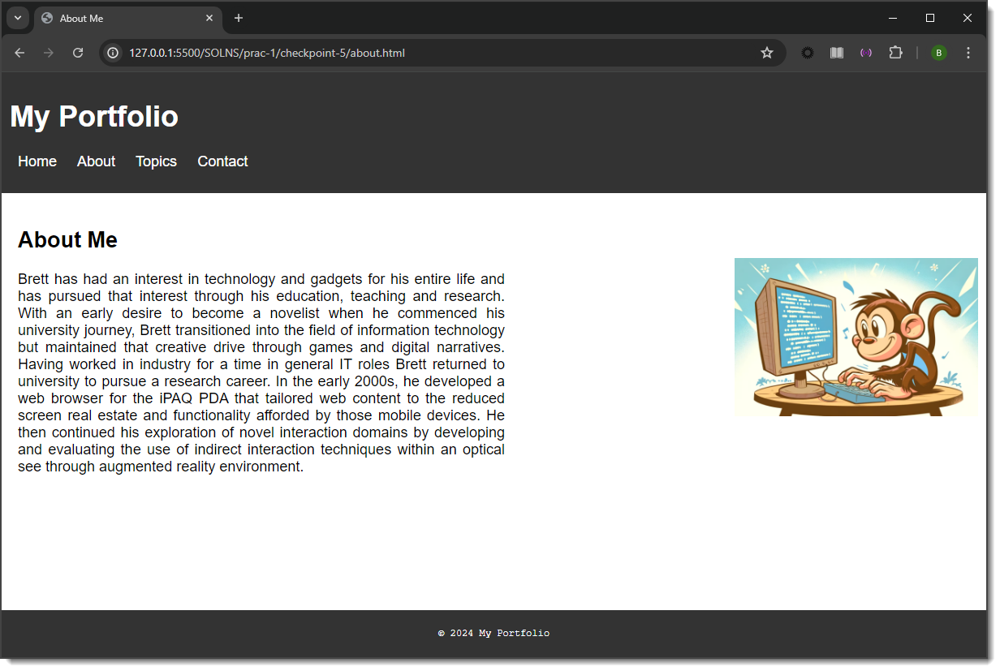

# Tutorial 04

This tutorial (held in Week 05) will look at HTML and CSS.

Typically, the tutorials will be broken into distinct tasks where you are encouraged to either work in small groups or discuss the material openly with the wider tutorial class. Where applicable, the tutorial tasks will relate directly to your assignment development. Engagement with this process will assist your understanding of the assignment requirements and may contribute toward the deliverables.

We will start by reinforcing the GitHub cycle. You should have your environemnt set up and ready. If you have not completed Tutorial 00 or Tutorial 01, you will need to do this before the start of this tutorial.

## Task 01

You should work with your team on these initial tasks. The idea is to ensure you follow the GitHub cycle and become comfortable with the process.

You will start by making a simple change to the HTML file and pusing it to the repository.

Make sure that your have unzipped this project and have access to the Task01 folder.

1. Create a new Development Branch

You should neve make changes directly to the `main` branch. Instead, you'll create a separate branch just for youre work. This is referred to as the **feature branch** or **development branch**.

- At the bottom left of VS Code, click the branch name (it will likely say main). A pop-up will appear at the top of the window.
- Select Create new branch....
- Give your branch a descriptive name, like `add-my-name` or `update-header-style`. Press Enter. You'll now see the new branch name at the bottom left.

2. Modify your project

Open the index.html file in the Task01 directory.

- Add a new meta tag to `index.html` that is defined as `name="author"` with `content` of your FAN.
- Change the colour of the body background in `style.css` to something new.
- Save your changes using `Ctrl+S` or `Cmd+S`

3. Commit and Push your Branch
   Once you have saved your changes, you need to "commit" them. A commit is like a snapshot of your changes. You'll then "push" that commit to GitHub.

- Open the Source Control panel, click the Source Control icon (the three circles connected by lines) on the left sidebar.
- You'll see a list of your changed files. Hover over each file to see a preview of the changes.
- In the Message box at the top, write a short, clear message describing your changes (e.g., "feat: Added my name to the HTML file and changed background color").
- Click the Commit button.
- After committing, click the Sync Changes button that appears. This will both fetch and push your changes to GitHub.

4. Submit a Pull Request (PR)
   A Pull Request is a way of asking other tema members to review you changes and merge them into the `main` branch. It is an essential part of the collaborative process.

- In VS Code's Source Control panel, after you have pushed your changes, a button will appear that says **Create Pull Request**. Click it.

- A new panel will open.  The PR page will be prefilled with your branch name and a commit message.
- Add a clear title and a detailed description of your changes based on the template provided.
- Set the PR ROster `@` value for one of your group members.
- Click Create to create the PR.

5. Review adn Merge the PR

Now, the designated member will review your changes.
- They can see the code you changed and add comments or ask questions.
- Once they're happy with the changes, they'll approve the PR.
- The reviewer will then click the Merge pull request button.

## Task 02

### Dealing with Conflict

This step simulates a common proble in team collaboration: two people making changes to the same part of the code at the same time.  The goal is to practice resolving these conflict.
1. Get the latest code
- Just like before, the first step is always to have the most currect version of the code, e.g. Fetch the latest changes from `main`.
- Create your own development branch.
  - Define a suitable branch name based on the naming convention provided in previous tutorials.
- Modify your work
    - Change the colour of the body background in `style.css` to a new colour.
    - Modify the `h1` tag in `index.html` to provide a different page heading.

2. Commit and push your changes.
- At this stage each group member would have made their own changes to the file.

3. Define a PR.

4. Resolve the conflict.
When you crate a PR, GitHub will warn you about a conflict.
- VS Code will now alert you to a merge conflict. It will show you the conflicting files (index.html and style.css) and provide options to Accept Current Change, Accept Incoming Change, or Accept Both Changes.
- Do not use the automatic options! Instead, manually open each conflicting file. You will see markers showing your code (`<<<<<<<`) and the incoming code `(>>>>>>>`).
- For index.html: Look at the `<h1>` tag. You will see both titles. Decide which one you want to keep, and manually delete the other one along with the conflict markers (`<<<<<<<`, `=======`, `>>>>>>>`).
- For `style.css`: Look at the `#member-list` rule. You will see both `list-style-type` values. Choose the one you want to keep and delete the rest.
- Save both files.
- In the Source Control panel, the files will be listed under "Merge Changes." Commit the changes with a message like "fix: resolved merge conflict."
- Push your changes.

5. Submit and Merge the PR
Create a new Pull Request. This time, since the conflicts are resolved on your local branch, the PR should be mergeable.

- Your reviewer can now review and merge your changes.

## Task 03

For the following steps you will create and modify a new web site.  While the instructions talk about checkpoints, these are intended to demonstrate milestones and not specific assessment elements.  For each checkpoint you should follow the GitHub cycle to practice the update process.

<h3><strong>Checkpoint 1</strong></h3>

For this first checkpoint, you should make sure you have completed the steps in Tutorial 00, which will guide you through setting up your environment.&nbsp; Once you have your workspace set up you can continue with the tasks below.

Whilst there are several different options available for editing and viewing HTML documents, we will be standardising our development environment to use Visual Studio Code (known as &lsquo;VS Code&rsquo;) and Google Chrome. Both are freely available and support Windows, macOS, and Linux systems.

All checkpoint tasks were developed in VS Code and tested in Chrome. Whilst you may use an alternative code editor if you wish, note that all descriptions assume VS Code and all practical submissions will be assessed using Chrome.

<ol style="list-style-type: decimal;">
    <li>Open the folder called <strong>prac-1/checkpoint-1/</strong>. &nbsp;It is best to avoid spaces in directory and file names as they can be a cause of issues (you will have likely seen the text %20 in URLs before, which is the character code used to represent a space). If you wish to separate words, use a dash (recommended) or an underscore instead.</li>
    <li>Open the index.html file in Chrome.</li>
    <li>You should see something that looks like the image below:    </li>
        <li>Edit the TODO sections as instructed to fill in the missing content. Save your changes.</li>
    <li>Switch back to Chrome and refresh the page to verify your changes appear as you expect.</li>
    <li>An example of what the final page should look like is shown below.  </li>
</ol>

End of Checkpoint 1.&nbsp; Note that there are no styling requirements for this checkpoint.

<h3><strong>Checkpoint 2</strong></h3>

This checkpoint will involve adding navigation to the index.html page and adding an additional file to your project.

<ol style="list-style-type: decimal;">
    <li>In your <strong>prac-1</strong> directory, create a new folder named <strong>checkpoint-2</strong>.</li>
    <li>Copy <strong>index.html</strong> from <strong>checkpoint-1</strong> to <strong>checkpoint-2</strong>.</li>
    <li>Open the <strong>checkpoint-2</strong> version of <strong>index.html</strong> in VS Code.</li>
    <li>Define links for each of the items in the nav section.&nbsp; The links should go to the following pages:
        <ul>
            <li>index.html</li>
            <li>about.html</li>
            <li>topics.html</li>
            <li>contact.html</li>
        </ul>
    </li>
    <li>With the links set up your index.html page should now look similar to this:  </li>
    <li>Add the <strong>about.html</strong> file to your <strong>checkpoint-2</strong> directory.</li>
    <li>Set up the navigation items as you have just done with the <strong>index.html</strong> page.</li>
    <li>Complete the todo section.</li>
</ol>

End of Checkpoint 2. Note that there are no styling requirements for this checkpoint.

<h3><strong>Checkpoint 3</strong></h3>

This checkpoint will involve creating a new file called contact.html and adding form fields for user input.

<ol style="list-style-type: decimal;">
    <li>In your <strong>prac-1</strong> directory, create a new directory called <strong>checkpoint-3</strong>.</li>
    <li>Copy <strong>index.html</strong> and <strong>about.html</strong> from the <strong>checkpoint-2</strong> directory to the <strong>checkpoint-3</strong> directory.</li>
    <li>Create a new file in <strong>checkpoint-3</strong> called <strong>contact.html</strong>.</li>
    <li>Define the following meta tags and values:
        <ul>
            <li>charset: UTF-8</li>
            <li>author: <em>your name</em></li>
            <li>description: Practical 1</li>
            <li><em>Remember, in VS Code you can use the shortcut of a single ! and Enter to construct the skeleton of a webpage.</em></li>
        </ul>
    </li>
    <li>Set the page title to Contact Me.</li>
    <li>Define the body structure the same as the <strong>index.html</strong> and <strong>about.html</strong> files, e.g., body, header, nav, main, section, footer.</li>
    <li>Make sure you have implemented the same navigation (including links) and footer elements as the other files.</li>
    <li>Add a `heading 2` to the page section with the value Contact Me.</li>
    <li>Define a form for the page.</li>
    <li>Define an unordered list that contains the required form elements:
        <ul>
            <li>Name - text input type</li>
            <li>Email - email input type</li>
            <li>Phone - number input type</li>
            <li>Message - text area input type, set to 5 rows</li>
            <li>Submit button - submit input type </li>
        </ul>
    </li>
    <li>Each of the input fields should include an appropriate type, name and id attribute.</li>
    <li>The name, email, message fields should be set to required.&nbsp; To reinforce this in the user you should also include placeholder text of "Required" in these fields.&nbsp; This can be achieved using the appropriate attribute and value.</li>
    <li>These edits should result in the following:  </li>
</ol>

End of Checkpoint 3. Note that there are no styling requirements for this checkpoint.

<h3><strong>Checkpoint 4</strong></h3>

For this checkpoint you will create a new page (<strong>topics.html</strong>) and populate it with a table.

<ol style="list-style-type: decimal;">
    <li>In your <strong>prac-1</strong> directory, create a new directory called <strong>checkpoint-4</strong>.</li>
    <li>Copy <strong>index.html</strong>, <strong>about.html</strong>, and <strong>contact.html</strong> from the <strong>checkpoint-3</strong> directory to the <strong>checkpoint-4</strong> directory.</li>
    <li>Create a new file in <strong>checkpoint-3</strong> called <strong>topics.html</strong>.</li>
    <li>Define the following meta tags and values:
        <ul>
            <li>charset: UTF-8</li>
            <li>author: <em>your name</em></li>
            <li>description: Practical 1</li>
            <li><em>Remember, in VS Code you can use the shortcut of a single ! and Enter to construct the skeleton of a webpage.</em></li>
        </ul>
    </li>
    <li>Set the page title to My Topics.</li>
    <li>Define the body structure the same as the previous files, e.g., body, header, nav, main, section, footer.</li>
    <li>Make sure you have implemented the same navigation (including links) and footer elements as the other files.</li>
    <li>Add a heading 2 with the value My Topics.</li>
    <li>Create a table with a heading row and four content rows.</li>
    <li>The table should have three columns:
        <ol style="list-style-type: decimal;">
            <li>Topic ID</li>
            <li>Topic Name</li>
            <li>Topic Coordinator</li>
        </ol>
    </li>
    <li>Each topic ID should be a link to the Flinders University Handbook page for that topic.</li>
    <li>Each topic coordinator should have a link that allows the user to send them an email message.</li>
    <li>This will result in the following page:   </li>
</ol>

End of Checkpoint 4. Note that there are no styling requirements for this checkpoint.

<h3><strong>Checkpoint 5</strong></h3>

For this last checkpoint we will be styling our pages to give them a consistent look and ensure that the presentation is clean and usable.

<ol style="list-style-type: decimal;">
    <li>In the <strong>prac-1</strong> directory, create a new folder named <strong>checkpoint-5</strong>.</li>
    <li>Copy all the files from <strong>checkpoint-4</strong> into your <strong>checkpoint-5</strong> directory.</li>
    <li>In the <strong>checkpoint-5</strong> directory create a new folder named <strong>images</strong>.</li>
    <li>Add the image <strong>CodeMonkey.png</strong> (from checkpoint-1 folder) to the images folder.</li>
    <li>In the <strong>checkpoint-5</strong> directory create a new folder named <strong>styles</strong>.</li>
    <li>In the <strong>styles</strong> directory create a new file named <strong>style.css</strong>.</li>
    <li>In each of the original files in your project (<strong>index.html</strong>, <strong>about.html</strong>. <strong>topics.html</strong>, and <strong>contact.html</strong>), include the relevant link to the <strong>style.css</strong> file to ensure all pages are using the CSS for their look and feel.</li>
    <li>You will need to implement appropriate CSS to achieve the following look across all of the pages:    </li>
    <li>All font on each page (except for the footer) should be set to:
        <ol style="list-style-type: decimal;">
            <li>Font: Arial (fall back Helvetica then sans-serif)</li>
            <li>Font size: 18px</li>
        </ol>
    </li>
    <li>For the header section:
        <ol style="list-style-type: decimal;">
            <li>Background colour: #333</li>
            <li>Font colour: #fff</li>
            <li>Padding of 10px all around</li>
        </ol>
    </li>
    <li>For the navigation list:
        <ol style="list-style-type: decimal;">
            <li>There should be no bullet points</li>
            <li>Font colour: #fff</li>
            <li>Margin for each list item should be 10px</li>
            <li>The list should be displayed inline</li>
            <li>There should be no decoration for the links (i.e., no underline)</li>
            <li>When the user hovers over the navigation menu items the font colour should be #ff0</li>
        </ol>
    </li>
    <li>For the University link on the index.html page:
        <ol style="list-style-type: decimal;">
            <li>Colour: #0202ee</li>
            <li>There should be no underline</li>
            <li>On hover we should see an underline</li>
            <li>When the link has been visited the colour should be #5656ff</li>
        </ol>
    </li>
    <li>For the footer section:
        <ol style="list-style-type: decimal;">
            <li>The background colour should be #333</li>
            <li>Font: Courier New (fall back Courier, then monospace)</li>
            <li>Font size: 12px</li>
            <li>Font colour: #fff</li>
            <li>Footer text should be aligned to the centre of the page</li>
            <li>Footer should have 10px padding top and bottom and 0px padding left and right</li>
            <li>Footer should be 100% of the page width</li>
            <li>Position should be set to fixed and offset from the bottom of the page by 0px</li>
        </ol>
    </li>
    <li>Save and test you index.html page to ensure it looks like the image above.</li>
    <li>On the About Me page:
        <ol style="list-style-type: decimal;">
            <li>Width of the brief bio paragraph should be 600px</li>
            <li>Brief bio paragraph should have justified formatting</li>
            <li>Add the image CodeMonkey.png
                <ol style="list-style-type: decimal;">
                    <li>It should be 300px in width</li>
                    <li>It should only be displayed once (i.e., it shouldn't be tiled or repeating)</li>
                    <li>It should be placed in the top right corner of the main section, set 80px from the top and 10px from the right</li>
                </ol>
            </li>
        </ol>
    </li>
    <li>With these changes in place the About Me page should appear similar to the following screenshot.    </li>
    <li>On the Topics page:
        <ol style="list-style-type: decimal;">
            <li>The table should be 65% of the page width</li>
            <li>The table should have a margin of 20px top and 0px left</li>
            <li>The header row of the table should have a background colour of #f2f2f2</li>
            <li>Each cell should have a solid 1px border, coloured #ddd</li>
            <li>The cell borders should be collapsed (e.g., a single line rather than double lines)</li>
            <li>Each cell should have 8px padding all around</li>
            <li>The text in the table should be left aligned</li>
            <li>The links in the table should be coloured #0404d4, with no decoration</li>
            <li>When hovered the links should be coloured #030368, and shown with an underline</li>
        </ol>
    </li>
    <li>Compare your work to the following screenshot.    </li>
    <li>On the Contact Me page:
        <ol style="list-style-type: decimal;">
            <li>The input fields should 
                <ol style="list-style-type: decimal;">
                    <li>be 500px wide</li>
                    <li>have a solid border of colour #d4dadc</li>
                    <li>have a margin of 3px top and bottom and none on left and right</li>
                    <li>have 6px padding all around</li>
                </ol>
            </li>
            <li>When focused (e.g., user has clicked in the input field) the input fields should have:
                <ol style="list-style-type: decimal;">
                    <li>no outline</li>
                    <li>a border colour of #263238</li>
                </ol>
            </li>
            <li>For the submit button
                <ol style="list-style-type: decimal;">
                    <li>ther should be no border</li>
                    <li>the font should be bold</li>
                    <li>the font should be in uppercase</li>
                    <li>the font colour should be #fff</li>
                    <li>the padding should be 10px top and bottom and 25px left and right</li>
                    <li>the background colour should be #c97413</li>
                    <li>when hovered the button background colour should be #c68711</li>
                </ol>
            </li>
        </ol>
    </li>
    <li>That is the end of the changes to style, ensure your page looks like the screenshot below.   </li>
</ol>