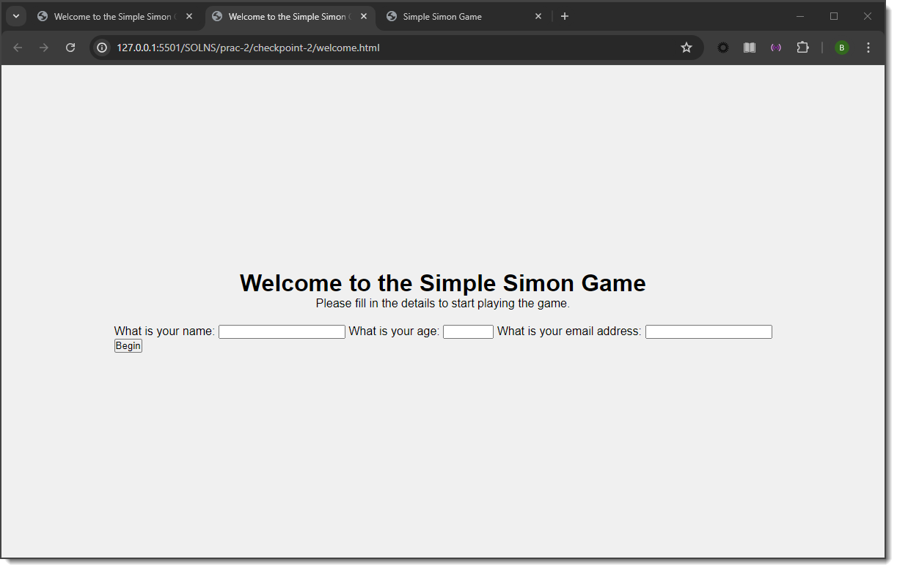

# Tutorial 05

This tutorial (held in Week 06) will look at JavaScript.

Typically, the tutorials will be broken into distinct tasks where you are encouraged to either work in small groups or discuss the material openly with the wider tutorial class. Where applicable, the tutorial tasks will relate directly to your assignment development. Engagement with this process will assist your understanding of the assignment requirements and may contribute toward the deliverables.

For each task listed below, ensure you are using the GitHub cycle, i.e., create a separate dev branch for each checkpooint before practicing the PR, review, and merge operations. For the tutorial tasks listed here, just assign yourself the PR review.

## Task 01

For this tutorial you will be creating a simple pattern recognition game that you may be familiar with from childhood toys. The game is called Simple Simon and it requires the player to match a growing sequence of colours, scoring a point for each correct match of a sequence. The image below shows the type of electronic game you may be familiar with:


<mark>Start by creating a new dev branch for Task 1.</mark>

For this first task we will get the initial structure defined for the required pages - **welcome.html** and **game.html**.
1. Start VS Code and open your **Tutorial05** folder.
2. Within the **Tutorial05** folder create a new folder called **task-1**.
3. In this **task-1** folder create two new files: **welcome.html** and **game.html**.  We will just create the html structure in this task and start the styling in the next task.
4. Use the "**! \<Enter key\>**" shorthand to create the initial structure for both pages.
5. For the **welcome.html** page:
    1. Create a meta **author** tag and set the **content** to your name.
    2. Set the **title** of the page to "*Welcome to the Simple Simon Game*".
    3. Create a [**header**](https://developer.mozilla.org/en-US/docs/Web/HTML/Reference/Elements/header) and [**main**](https://developer.mozilla.org/en-US/docs/Web/HTML/Reference/Elements/main) section within the **body** of your page.
    4. In the **header** set a heading 1 with the value "*Welcome to the Simple Simon Game*", and a paragraph with the text "*Please fill in the details to start playing the game.*"
    5. In the **main** section you should define a form that uses the **GET** **method** to pass information through the url, and set the **action** to **game.html**
    6. The form should be defined with four input elements:
        1. Input type: **text**, label: "*What is your name:*", required field
        2. Input type: **number**, label: "*What is your age:*", range: 10-100, required field
        3. Input type: **email**, label: "*What is your email address:*", required field
        4. Input type: **submit**, value: "*Begin*"
    7. This should result in the following page:
    

    
6. For the **game.html** page:
    1. Create a meta **author** tag and set the **content** to your name.
    2. Set the **title** of the page to "*Simple Simon Game*".
    3. Create a **header** and **main** section within the **body** of your page.
    4. In the **header** set a heading 1 with the value "*Simple Simon Game*", a paragraph with the text "*Watch the pattern and repeat!*", and a button with the text "*Start Game*".
    5. In the **main** section, we want to create the skeleton structure for the game board and the individual buttons which will allow us to produce the following result later in the tutorial:


7. In the **main** section
    1. Define a **div**.
    2. Inside this **div**, define another **div**.
    3. Inside the second **div**, define four **button**s with no value.
    4. Finally, after of the **main** section, define a **div** that contains two paragraphs, one with the text "*Previous Score: 0*" and the other empty.
    5. This should result in the following page:


Commit, PR, and merge the dev branch.

## Task 02

This task will involve styling various elements of our **welcome.html** page.  <mark>Create a new dev branch for Task 02.</mark>
1. In your **Tutorial05** directory create a new folder named **task-2**.
2. Copy the files **welcome.html** and **game.html** from **task-1** to **task-2**.  Make sure you are working with the **task-2** version of the **welcome.html** and **game.html** files.
3. Create a new folder in **task-2** named **styles**.
4. Create a new file named **style.css** in the **styles** folder.
5. We will start by defining the style for the broader page elements and then look at the specifics of the form and game board.
6. In **welcome.html** add a link to the **style.css** file you have just created:

    ```<link rel="stylesheet" href="./styles/style.css">```

7. Open **style.css** and begin defining properties for the body
    1. Font should be set to Helvetica (fallback Arial then sans-serif)
    2. The colour of the page should be set to: #f0f0f0
    3. We want the welcome form displayed in the middle of the screen, so we will use the properties associated with the flexible box layout:
        1. Set the **display** to flex
        2. Set the **flex-direction** to column
        3. **justify-content** should be centred
        4. **align-items** should be centred
    4. To ensure the elements on the page are in the middle of the page, set **height** to **100vh**
    5. Finally, set margins to 0
8. Now we will add some styling to the **header** and **main** sections.
    1. Create a new entry in **style.css** for the **header**
    2. **text-align** should be centred
    3. Set the bottom **margin** to 20px
    4. make the header **width** 100%
    5. Create a definition for **main** and set the **text-align** to left.
9. Finally, add in a reference to all items (i.e., *) and set the **padding** and **margins** to 0px
10. These changes should result in the following for **welcome.html**:



Now we will define some styling to present the form.
1. Open the task-2 version of **welcome.html** so we can add some identifiers to our existing elements.
    1. Define an **id** for the form as "*player-form*"
    2. Create a **div** around the three input elements (name, age, and email) and set the **class** of this **div** as "*form-card*"
    3. Set the **class** for each of the input items (name, age, and email) to "*form-item*"
    4. Set the **class** of the Begin button to "*quiz-button*".  Note that the Begin button should be defined outside of the **div**: form-card
2. Go back to **style.css** and modify the elements that we have just identified:
    1. Add a reference to the **id** *player-form*
    2. In the *player-form*, set the **padding** all around to 30px
    3. Set the **margin** to 60px top and bottom and auto for the left and right
    4. Set the **width** to 400px
    5. Set the *player-form* colour to #fff
    6. Define a 1px solid border for the form that is #d2d2d2 in colour
    


3. Now we will clean up the elements that are within the *player-form*
    1. Define the *form-card* class reference
        1. Set the **min-height** to 250px
        2. Set the **text-align** to left
    2. Define the *form-item* class reference
        1. Set the **padding** all around to 10px
        2. Set the **margin** to top and bottom 10px and left and right 0px
        3. Set the **border** to solid 1px coloured #373434
        4. The *form-items* should be **display**ed using block layout
        5. The **width** of the form-items should be 100%
        6. The **box-sizing** should be set to *border-box*, which will help with the spacing around the input fields
    3. Now we can define the properties of the Begin button
        1. Define the *begin-button* **id** reference
        2. Set the **padding** to 10px top and bottom and 25px left and right
        3. The **font** should be set to bold uppercase
        4. The **font** colour should be #fff
        5. There shouldn't be a **border** around the button
        6. The background colour should be #006aff
4. These style changes should result in the following **welcome.html**


Commit, PR, and merge the dev branch.

## Task 03

<mark>Create a new dev branch for Task 03.</mark>  Create a new folder named **task-3** and copy the contents from **task-2**.

Now we will apply similar style changes to the **game.html** page before implementing interactions in the following tasks.

1. Open **game.html** and add a link to the stylesheet.  Set up the identifications for the various elements on the page:
    1. For the first **div** within the **main** section, set its **id** to "*game*" - this is the outside border panel of the game
    2. The second **div**, set this **id** to "*game-buttons*" - this is for the broader button definitions
    3. For each **button** set the shared **class** to "*game-btn*" and then a unique **id** for each (e.g., btn1, btn2, etc.)
2. Open the **style.css** file and start to style the game area.
    1. Define a reference to the **id** "*game*"
        1. Set the **background-color** to #3b3b3b
        2. Set the **padding** all around to 20px
        3. We want a slight curve to the corners to give a rounded rectangle appearance, set the **border-radius** to 8px
        4. Set the **width** of the game area to 300px
        5. Set the **margins** all around to auto

These changes should result in the following:


2. Now we will define the general features of the buttons
   1. Create a reference to the **id** "*game-buttons*"
      1. We want the buttons to be evenly spaced within the game board area so set the **display** to *flex*
      2. Then **justify-content** with the *space-around* value

These changes should result in the following:


3. Now we can define the button shapes and colours themselves
    1. Create a reference to the *game-btn* class
        1. Set the **width** and **height** of the buttons to 60px
        2. Set each button to have no border
        3. Set the **border-radius** to 50% to ensure the buttons are circular
        4. Finally, to provide some feedback to the player set the **cursor** to *pointer* - this will change the cursor from the arrow to the pointer when the player hovers over the buttons.
    2. Lastly, for each of the unique button **id**s that you have defined set the background colour of each of them to the following (from left to right): red, green, blue, yellow.
    


4. To finish off the styling for this page we will add some identifiers and properties to the Start Game button, as well as the text messages on the page.
    1. In **game.html** set an id of "*start-btn*" for the Start Game button
        1. In **style.css**, create a reference to *start-btn*
        2. Set the **padding** to 10px top and bottom and 20px left and right
        3. Add some space above the button, by setting an appropriate **margin** for just the top to 10px
        4. Set the background colour to #4caf50
        5. Set the font colour to #fff
        6. Remove the **border** from the button
        7. Set the **border-radius** to 4px
        8. As we did with the game buttons change the **cursor** to a *pointer*

This should result in the following:


5. The last styling we will do for this task is to modify the message in the **header** and the score below the game board.
    1. In **game.html**, define an **id** of "*status-message*" for the paragraph tag in the **header**
    2. Still in **game.html**, locate the **div** we created after the **main** element and set its **id** to "*score-details*".
    3. Set the **id** of the first paragraph in this **div** to "*score-message*"
    4. Set the **id** of the second paragraph in this **div** to "*high-score*"
    5. Open **style.css**
        1. Set up a reference to *status-message*
            1. Set the **font** size to 24px and make it bold
            2. Add some space at the top, so set the top **margin** to 20px
        2. Set up a reference to *score-details* - we will set some values that will accommodate changes and additions we will make in the coming tasks
            1. Set the text to be aligned to the centre
            2. We want clearance all around the **div**, so set the **margin** to 10px all around
            3. We want some spacing between this text and some text we will add in the future, so set the **line-height** to 1.5
            4. Finally, set the **font** size to 18px

All these changes should now result in the following for the **game.html** page:


Commit, PR, and merge the dev branch.

## Task 04

For this task we will start to set up some of the interactions within the game loop.  <mark>Create a new dev branch for Task 04.</mark>

1. We will start by copying all of the content from **task-3** into a new folder named **task-4**.  Ensure that when needed you are making changes to the task-4 version of the **game.html** and **welcome.html** files.
    1. Within **task-4** create a new folder named **scripts**.
    2. Create a new file in the **scripts** folder named **script.js**.
    3. In **game.html**, add an appropriate *defer* reference to our newly created **script.js** file.  This can be placed at the bottom of the body section for ease of reference.

    ```html
    <script src="./scripts/script.js" defer></script>
    ```

    4. Open **script.js**
    5. Before we start writing any functions, we need to get some references to the various DOM elements we will be working with:
        1. Using the `getElementById` set up a reference to the **start-btn** and **status-message**, e.g.,:
            ```javascript
            const startButton = document.getElementById('start-btn');
            ```
        2. We also want to access the player name from the parameters sent to **game.html** through the appended URL.
            ```javascript
            const playerName = new URLSearchParams(window.location.search).get('name');
            ```
        3. We also need to define an array for the various colours that will appear on our game board:
            ```javascript
            const colors = ["red", "green", "blue", "yellow"];
            ```
    6. We then need to create a few variables to keep track of the sequence of play and to determine whether it is the player's turn or the system's turn to play.
        1. Define two array variables, one named **gameSequence**, and the other named **playerSequence**.
        2. Define a variable named **round** to keep track of which round we are up to, initialise this with the value 0.
        3. Define a boolean variable named **isSimonTurn** and set it to false.

Now with our various properties referenced we can start to build out the functionality of our interactions.

2. Let's start by defining the event listener for the **startButton**.  Within the click event listener, we want to disable the start button (to make sure the player doesn't keep clicking on it after the game starts) and to start the game loop.

    ```javascript
    startButton.addEventListener('click', () => {
        startButton.disabled = true;
        playSimonSequence();
    }); 
    ```

3. With the above code, the following is taking place:
    - Line 1: we are defining the event listener for the startButton [`addEventListener`]
    - Line 1: we are listening for click events [`'click'`]
    - Line 1: when a click event occurs we will execute the anonymous function [`( )`] (we are also using the arrow function notation [`=>`] here)
    - Line 2: disable the startButton
    - Line 3: execute the `playSimonSequence` function - to be done in the coming steps

4. We want to randomly assign colours to our growing sequence that the player needs to match.  We have already defined an array of `colours` as well as an array for `gameSequence`.  So we want to define a function that will generate a random value between a minimum value and a maximum value.
    1. Define a function named `getRandomNumber`.
    2. The function should accept two arguments: `min` and `max`.
    3. When the function executes we should return the result of the following calculation: 

    ```javascript
    Math.floor(Math.random() * (max - min + 1)) + min
    ```

5. With the Start Button listener defined and the random colour function defined we can now define a new function for `playSimonSequence`.
    1. In this function we need to set `isSimonTurn` to true.
    2. We need to set the `textContent` of the `statusMessage` to "Simon's Turn".
    3. We want to add (or `push`) a new random colour onto our `gameSequence`.  To access a random colour within our `colours` array, we can use the `getRandomNumber` function with a range from 0 to 3, e.g.,`colours[getRandomNumber(0, 3)]`

Save your work and test that the **game.html** file behaves as expected when the user clicks the Start Button, i.e., the text in the status-message paragraph should update to "Simon's Turn".


6. Now we want to start to develop the sequencing for the game, e.g., random colour sequence is displayed and the player will need to match that sequence to proceed to the next round.  To provide feedback to the player we will adjust the opacity of the coloured buttons.
7. Start by declaring a new function named `animateSequence` that accepts an integer argument named `index`.
    1. We will use the `length` of the `gameSequence` array to determine whether we still need to display the colour sequence.  Define an `if` statement, checking if the `index` is less than the `gameSequence` `length`.
    2. Inside the `if` statement you need to declare a new `const` named `button`.
    3. Recall in our **game.html** file we have defined the colour buttons with a sequential id, i.e., 'btn1', 'btn2', 'btn3, and 'btn4'.  We will use this naming detail to assign a specific coloured button to our `const button`.
    4. We need to access the `document` and `getElementById`.  The id we are looking for is the current value at `gameSequence[index]`.  however, since this is an array that starts indexing at 0 we need to add 1 to the result.  We will then concatenate this result to the string 'btn' to give us the required reference.:

        ```javascript
        const button = document.getElementById(`btn${colours.indexOf(gameSequence[index]) + 1}`);
        ```

    5. Now that we have a reference to the correct `button`, set the `style.opacity` to '0.5'.
    6. Finally, call `animateSequence` from the `playSimonSequence` function - add this at the end of the function, after we push a new random colour onto the `gameSequence` array. Note: this is the first time we are calling `animateSequence` to start cycling through our array, therefore pass a suitable argument to ensure we start at the beginning of the array.

Save you file and test your work. You should see that now when you click the start button, one of the coloured buttons will dim.  If you refresh your browser and hit Start Game again another button will dim - you may need to run this several times until a different random button is added to the gameSequence.

8. We don't want the button to always remain dim, so we will use a `setTimeout` of 500 ms before resetting the `opacity` to '1'.
    1. After the line where we set the button opacity to '0.5', add the following code which makes use of an anonymous arrow function:

```javascript
    setTimeout(() => {
        button.style.opacity = '1';
    }, 500);
```
    
9. Save and test your work again.  What we should now see if the button will go dim for a short period of time and then return to the intended opacity.
    3. In the actual game there will be a sequence of multiple colours that the player will be shown.  This sequence will grow with each round the player successfully completes.  To ensure we display each colour in the sequence we need to call the `animateSequence` function once we return the button opacity back to 1.
    4. So within the setTimeout arrow function, add a call to animateSequence but increment the index value, e.g.,

```javascript
    animateSequence(index + 1)
```

10. In the game, we need to provide suitable delay between each button change, otherwise the player would not be able to keep track of or process the sequence very effectively.  To do this we will introduce another `setTimeout` function call that will delay the sequence.
    1. Within the `if` statement wrap the current content (button declaration, button opacity, and the setTimeout) within another setTimeout that delays for 1000ms, e.g., pseudocode:

```
    function animateSequence {
        if {
            setTimeout {
                button declaration
                button opacity 0.5
                setTimeout {
                    button opacity 1
                    animateSequence index+1
                } 500ms
            } 1000ms
        }
    }
```

Test your solution again and notice the delay before the button dims.

11. Once we have progressed through the full game sequence, we need to get prepared for the player's interactions.  We can set this up in an `else` clause for the current `if` statement.
    1. Within the `else` clause set `isSimonTurn` to `false`.
    2. Change the `statusMessage` to the player's name followed by the string "Turn", e.g., "Brett's Turn".
    3. Set the `playerSequence` array back to empty, e.g., `playerSequence = [];`
    4. Save your work and test to see whether the `statusMessage` updates to show the player's name which was entered through the **welcome.html** page.
    
<table>
    <tbody>
        <tr>
            <td></td>
            <td></td>
        </tr>
        <tr>
            <td style="text-align: center;">Game state during <code>animateSequence</code></td>
            <td style="text-align: center;">Game state after <code>animateSequence</code></td>
        </tr>
    </tbody>
</table>

Commit, PR, and merge the dev branch.

## Task 05

For this last task we will implement the player interactions and general scoring and game flow.  <mark>Create a new dev branch for Task 05.</mark>  Copy all the contents from the **task-4** directory into a new **task-5** directory.  Ensure that you are working with the task-5 project files.

1. First we need to get access to the coloured buttons. Declare a new constant named `gameButtons` and use `querySelectorAll` to access all buttons with a class reference of `game-btn`.
2. While we are defining access to various DOM elements declare a constant for `scoreMessage` and `highScoreMessage` and connect them to the appropriate id within **game.html**.
3. Now we want to set up event listeners for each of the coloured buttons.
    1. Use a `forEach` loop to cycle through each game button in the `gameButtons` list.
    2. For each `button` add the event listener for a button `'click'`
    3. And on each click call a function (which we will define next) named `handleButtonClick` which takes the `index` of the colour button in the `gameButtons` list as an argument
                
    ```javascript                
    gameButtons.forEach((button, index) => {
        button.addEventListener('click', () => {
            handleButtonClick(index);
        });
    });
    ```

4. Now we can define the function for **handleButtonClick**
    1. Declare the function: `function handleButtonClick(colourIndex)`
    2. The user should only be able to interact the buttons if it is the player's turn.  Define an `if` statement that checks to see whether it is **not** Simon's turn.
    3. Inside the `if` statement (e.g., if it is not Simon's turn), get the element from the `colours` array at location `colourIndex` and assign this to a new local `const colour` variable.
    4. `push` this newly captured `colour` onto the `playerSequence` list.
    5. Use a `getElementById` and the `colourIndex` to assign the button at *btn+colourIndex+1* to a local `button` variable.
    6. Use this button variable to set the `opacity` of the button to `'0.5'`.
    7. Finally, define a time out period of 300ms and set the `opacity` back to `'1'`.
    8. Save your work and test the changes.  You should see that when it is the player's turn you can click on each of the coloured buttons and see a change in opacity.

5. Now we need to implement the game logic, i.e., test to see if the player's input matches the game sequence.
    1. Declare a function named `checkPlayerSequence()`
        1. Declare a `for` loop that progress from 0 to less than the `playerSequence.length`.
        2. Within the `for` loop, check `if` the current value in the `playerSequence` is not the same value as the current element in the game sequence, e.g., has the player clicked the correct button based on the colours defined in the game sequence.
        3. If the `playerSequence` value and the `gameSequence` value are not equal:
            1. Set the `statusMessage` to **"Game Over!"**, and
            2. Break out of the function by executing a `return`.
        4. To execute this function, add a call to `checkPlayerSequence` after the `setTimeout` function call in the `handleButtonClick` function.
2. Save your work and test the changes.  What you should see is that when the player selects the incorrect button, the status message will display **"Game Over!"**.  If the player selects the correct button, we will not see any change in the display, we will implement the next round logic now.
6. Go back to the `checkPlayerSequence` function.  A successful player turn will mean the for loop will run through to completion without ever triggering the `if` statement.  If this is the case we need to start the next turn and have Simon add another colour to the game sequence.
    1. After the `for` loop in `checkPlayerSequence`, add an `if` statement that looks to see if the length of `playerSequence` is equal to the length of `gameSequence`, i.e., the player has guessed all the correct colours in the sequence.
    2. If the `playerSequence` length and `gameSequence` length are equal define a 500ms `setTimeout` call that increments the `round` value and sets the status message to **"Correct!"**.  Also within this `setTimeout` call, add a new 1000ms `setTimeout` call that calls the `playSimonSequence` function.
    3. Save and test your changes.  What you should now see is when the player provides the correct colour, the status message is updated and the game progresses to the next round.  If you keep getting the colours correct you will see the `gameSequence` list grow larger.
7. The last step for this task is to provide better definition to the player's achievements when the game ends.  To do this we will implement a new function named `gameOver()`.
    1. First we will declare some variables to let us access the `score-message` and `high-score` elements on our **game.html** page.
        1. At the top of your code where you have your other DOM element declarations add in one for `scoreMessage` and attach the `score-message` paragraph element to it.
        2. Do the same for a variable named `highScoreMessage` and attach it to the `high-score` paragraph element.
        3. Declare a variable named `highScore` and set its value to 0.
        4. Now we can create the necessary function.
    2. Declare the function `gameOver()`.
    3. When the player does not guess the right sequence of colours, they should be presented with the status message **"Game Over!"**, set this within the `gameOver` function.
        1. We can now replace the `statusMessage.textContent = "Game Over!";` code from step 6 above with a call to the `gameOver` function.
        2. After defining the change to the status message, update the `scoreMessage` so that it shows **"Previous Score: "** with the `round` value appended to the string, e.g., if the player got 6 separate rounds of colour sequences correct, they should see the following in the `scoreMessage` field: **"Previous Score: 6"**
        3. Now reset the `round` back to 0, reset the `gameSequence` back to an empty array, and enable the start button.
    4. Save your work and test to make sure it functions as expected, e.g., the player score is shown in the score-message paragraph.
    5. Finally we want to keep track of a progressive high score for the player, to keep them trying again to beat their previous high score.
        1. In the `gameOver` function, add a new line before you set the `round` value back to 0.
        2. At this point, check to see `if` `round` is greater than `highScore`.
            1. If `round` is larger than `highScore`, set `highScore` to the current value of `round`.
        3. Update the `highScoreMessage` to display, **"High Score: "** and then append the current `highScore` to this string.
        4. Save your work and test your code to ensure that the high score for the player is being recorded correctly.

This is the end of the tutorial.  You should now have a complete and functional game of Simon implemented as well as an ongoing track (within the one session) of the high score for the player.</p>