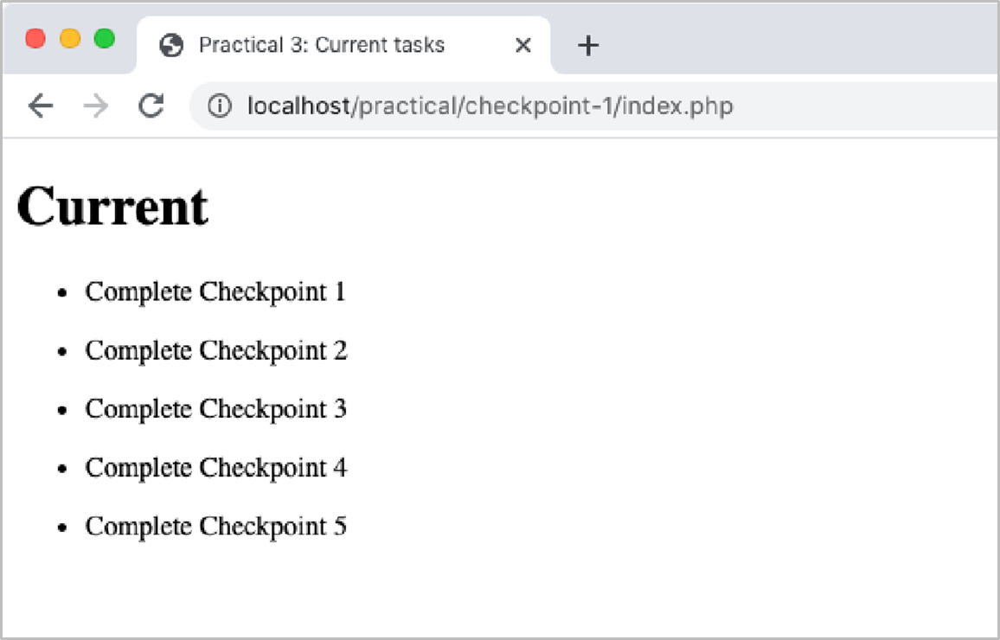

# Tutorial 06

This tutorial (held in Week 07) will look at PHP.

Typically, the tutorials will be broken into distinct tasks where you are encouraged to either work in small groups or discuss the material openly with the wider tutorial class. Where applicable, the tutorial tasks will relate directly to your assignment development. Engagement with this process will assist your understanding of the assignment requirements and may contribute toward the deliverables.

For each task listed below, ensure you are using the GitHub cycle, i.e., create a separate dev branch for each checkpooint before practicing the PR, review, and merge operations. For the tutorial tasks listed here, just assign yourself the PR review.

## Task 01

For all the activities in this tutorial you will need to run the Codespace on the Tutorials-2025 repo.

Recent updates to the codesapce environment and the communication with databases have caused some connection issues for some people. Before you start, open the .devcontainer folder in your repo and modify the first command in Dockerfile:

Change

`FROM php:8.2-apache`

to

`FROM mcr.microsoft.com/devcontainers/php:0-8.2`

Commit the changes. You should also do this in your Assignment repos.

Now you are ready to start the Codespace, follow these steps:

1. Make sure you have a copy of the Tutorials-2025 repo on github.com
   1. If you do not then use GitHub Desktop to create and publish the repo
2. Open github.com and navigate to the Tutorials-2025 repo
3. Click the Code button
4. Select the Codespaces tab
5. Click the Create codespace on main button
   1. Wait for the Codespace to start up, can take several minutes - if you click on the dialog that pops up at the bottom of the browser window, you can see the progress of the setup
   
6. Once the codespace has been created (you will know it is complete as you will see the PORTS tab with a notification bubble and additional extensions loaded down the left panel) click on the PORTS tab and then launch the page in a new browser tab (i.e., click the globe icon to load the page)
   1. The page should load in a new browser tab and should indicate a successful connection to the database
   
If the codespace does not load successfully or says that it is in recovery mode, verify that you have the correct folder structure in your repo root, e.g.,

```
Tutorials-2025
├── .devcontainer
├── .github
├── src
|  ├── inc
|  ├── Tutorial00
|  ├── Tutorial01
|  ...
|  ├── Tutorial05
|  ├── Tutorial06
|  └── index.php
└── README.md
```

If you have another folder sitting under your Tutorials-2025 root and then the devcontainer folder within that folder, the codespace will not load correctly.

Now that the codespace is running successfully, you will need to open a connection to the database.

1. In Codespace, open the .devcontainer folder and open the docker-compose.yml file
2. Look for entries with the following declarations:
   - MYSQL_HOST:
   - MYSQL_USER:
   - MYSQL_PASSWORD:
   - MYSQL_DATABASE:
3. Make a note of the values assigned to these variable, e.g., db, root, password, etc.. We will use these values in the connection to the database
4. Click on the Database extension in the left extensions panel
5. The file explorer panel has been replaced with a panel with a single button: Create Connection

6. In the panel that appears, fill in the details you sourced in the docker-compose.yml file

7. Click the +Connect button
8. In the left panel, drop down the database identifier (it will have a dolphin icon and start with 'db@' as the prefix) and you should see a Tables section with a table named 'messages'
9. Click on 'messages' to see the content of the table

Now that we have connected to the database, we need to import some tables and data for the practical work we will work through

1. In the file explorer open up Tutorial06/Task01 and you should see a number of folders, index.php, and db.sql. We will use the db.sql file to populate our database for this tutorial
2. Click on the Database extension to change the file explore panel to the database panel
3. Right click on your database name and select Import SQL from the popup menu
4. In the navigation list that appears at the top of the Codespace workspace,
   1. Click the .. to go to the root of the environment
   2. Scroll to the bottom of the list and select 'workspaces'
   3. Click on your repo name
   4. Click on 'src'
   5. Click on 'Tutorial06'
   6. Click on 'Task01'
   7. Click on 'db.sql' to import that script

When you refresh your database, you should now see that there are two tables in the database: `messages` and `users`.

The last step to do is to understand how to dump the structure and data from the database.  This is critical as you will need to complete this process to ensure your team members are all working on the same database structure and you are able to provide your database at the time of submission.

1. Open the File Explorer panel in the devcontainer VS Code interface
2. Right click on the Tutorial06 folder
3. Select 'New Folder...'
4. Name the folder `sqlExports`
5. Click on the Database extension in the left panel
6. Right click on the database name
7. Select 'Dump Struct and Data' from the popup menu
8. Click the `..` until you are at the root of the devcontainer
9. Scroll to the bottom of the list
10. Select `workspaces`
11. Select your repo name
12. Select the **sqlExports** folder
13. Click ok.  You will now have a dump of the database creation and insert content in the sqlExports folder.  Placing the file here means that on the next commit it can be available to your group

### Building a PHP site

For this tutorial, you will build a simple task list 'web app' using PHP.

Ensure that the Task01 folder is within the Tutorial06 folder and contains the following content:

```
Tutorial06
├── Task01
|  ├── inc
|  |  ├── dbconn.inc.php
|  |  └── menu.inc.php
|  ├── scripts
|  |  └── script.js
|  ├── styles
|  ├── db.sql
|  └── index.php

```

1. Open the **index.php** file, which contains the template of a tasks page that you will complete by adding the necessary PHP code so that it retrieves the current list of tasks from the database when loaded. If you inspect the contents of the file, you will note a comment block that contains the PHP opening (`<!-- <?php`) and closing (`?> -->`) tags that denote the block where PHP can be written. The `require-once` statement includes the contents of another PHP file, **dbconn.inc.php**, that will establish a connection to the database, so you should not delete it (you are encouraged to inspect it, though).
2. Within the PHP tags, below the `require-once`, create a variable called `sql` and assign it the following query string:
    

```
"SELECT id, name FROM Task WHERE completed=0;"
```

3. PHP includes native support for accessing various DBMSs. For this practical, you will use the procedural [MySQLi](https://www.w3schools.com/php/php_ref_mysqli.asp) interface to interact with the MySQL database and create/read/update records.

   The [`mysqli_query`](https://www.w3schools.com/php/func_mysqli_query.asp) function is used to submit a query to the database and retrieve the results. The function returns a result set on successful execution or a `false` value on failure, which makes it suitable for using within an `if` statement to ensure that result parsing only occurs when there are results available.

   Declare an `if` statement using the following as the condition:

```
$result = mysqli_query($conn, $sql) 
```

   The `$result` variable will store the result set on success and will be available within the `if` statement for parsing. The `$conn` variable is declared within **dbconn.inc.php** and holds a connection to the database, and the `$sql` variable is as defined previously.

2. Within the `if` statement, declare another `if` statement and use the [`mysqli_num_rows`](https://www.w3schools.com/php/func_mysqli_num_rows.asp)  function to check that the number of rows returned by the query is at least 1. The `mysqli_num_rows` function takes a result object as a parameter, which you have available as `$results`, and returns the number of rows.

3. You are now ready to parse the results and generate the HTML necessary to display them on the page. You can access each of the rows by using the [`mysqli_fetch_assoc`](https://www.w3schools.com/php/func_mysqli_fetch_assoc.asp) function, which will return an associative array for the next result row or `NULL` if there are no more rows. As with the `mysqli_num_rows` function, `mysqli_fetch_assoc` takes a result object as its parameter.

   Because there is likely to be more than one row of data, you will want to use a loop to iterate over each row. Within the `if` statement defined in step 7, declare a `while` loop using the `mysqli_fetch_assoc` function as the condition. The loop will cease when all rows in the result set have been iterated over.

```
while ($row = mysqli_fetch_assoc($result) { ... }
```

   Within the loop, use one or more `echo` statements to output the name of each task. You can access the task name via the row key name; i.e., `$row["name"]`. The tasks should be output as an **unordered list**, so you will need to surround the `while` loop with `echo` statements for the list tags and then incorporate the list item tags into your output of each task name within the loop &mdash; an example of this is as follows (shown in pseudo code):
        
```
echo opening list tag
while ($row = mysqli_fetch_assoc($result)) { 
    echo the task name within list item tags
} echo closing list tag
```
        
It is good practice to free up resources after they are finished with, so call [mysqli_free_result](https://www.w3schools.com/php/func_mysqli_free_result.asp) after the loop:

```
mysqli_free_result($result);
```

4. Finally, close the connection to the database by calling the [mysqli_close](https://www.w3schools.com/php/func_mysqli_close.asp) function as follows after the outer `if` statement you defined in step 6. The function takes in a reference to the current connection.

```
mysqli_close($conn);
```

   Navigate to **index.php** in a browser &mdash; click on the Ports tab, click on the Globe icon, in the browser tab that opens, add the following to the end of the URL: `/Tutorial06/Task01/` &mdash; and verify that you see a list of tasks.



## Task 02

This task will involve adding a menu to your page and styling it with CSS.

1. Make a copy of your **Task01** directory and name it **Task02**.
2. Open the **Task02** directory in VS Code.
3. Uncomment the following two lines in your index.php page

```
<!-- <?php require_once "inc/menu.inc.php"; ?> --> 
<!-- <script src="scripts/script.js" defer></script> -->
```
The first includes the contents of a menu file that is provided for you within the **inc** directory. The menu is composed of an unordered list of menu items (anchor elements). You will create the second and third pages in later tasks. Take note of the `id` attribute defined for the list, which you can use when styling it.

The second line references a script that has also been provided for you in the **scripts** directory. This script contains a JavaScript function that will apply a class called `selected` to the anchor element in the menu that corresponds to the current page. It does this by inspecting the current URL, via `document.location`, and checking for a match against each anchor element's `href` attribute. As before, you can use the class when styling the menu.

1. Within the **styles** subdirectory, create a new file called **style.css**. All CSS you create must be defined in this file. There should be no internal (via style tags) or inline (via a style attribute) CSS used.
2. Add a link element in **index.php** that refers to the **styles/style.css** file.
3. Edit **index.php** and **style.css** to produce a page that looks similar to the image below.
    
*Note that minor differences are fine as long as your page is a close replica*

**Key style details:**

- The margin for the entire page is 15px on all sides.
- The body font is Helvetica (fallback to Arial then sans-serif) and 14px in size.
- The heading font size is 16px and the font weight is bold. The heading also has a bottom margin of 10px.
- The paragraph/list item line height for each task in the list is 1.5em.
- Menu:
   - Each menu item has a right margin of 15px, a colour of black, and floats to the *left* of its container.
   - When hovered over, menu items change colour to #1565c0.
   - A selected menu item has a colour of #1565c0 and a font weight of bold.
   - The menu border is a solid 1px line in the colour #ddd (bottom only).
   - The menu has a bottom padding of 10px.
   - The menu has a bottom margin of 30px.

## Task 03
This Task will involve creating a new PHP page to add tasks.

1. Make a copy of your **Task02** directory and name it **Task03**.
2. Open your **Task03** directory in VS Code. Create two new files in the root of the **Task03** directory called **add.php** and **add-task.php**.
3. Edit **add.php** and **styles/style.css** to produce a page that looks like the image below. The provided HTML can be used as a starting point. *Note that minor differences are fine as long as your page is a close replica.*
    


**Additional style details:**
- All input elements should have...
   - a display property of block;
   - a 1px solid border in the colour #babdbe;
   - a left/right padding of 6px and a top/bottom padding of 3px;
   - a bottom margin of 10px.
- The text input element has a width of 300px and should also define the required attribute;
- The submit button text changes colour to #1565C0 when hovered over.

1. Ensure your text input element has a name attribute as you will need to reference this when retrieving its value. In your form element, define the `method` and `action` attributes accordingly:
   - Assign the `action` attribute a value of **add-task.php**.
   - Assign the `method` attribute a value of `POST`.
2. Within **add-task.php**, add PHP code to process the submitted form and insert a new record into the database.

   This file will process the form only, so it does not need any HTML and can therefore be a pure PHP file. At the top of the file, declare the PHP **opening tag**. As the form is submitted using the `POST` method rather than the `GET` method, the task name value will not be appended to the URL as a query string. Instead, the value will be stored in the body of the HTTP request. 

   You can access the value via PHP's "superglobal" [`$_POST`](https://www.w3schools.com/php/php_superglobals_post.asp) variable, which is an associative array of the current `POST` data. Key values in this array correspond to input element name attribute values.

   You can verify that a value is available for a given key by using PHP's [`isset`](https://www.w3schools.com/php/func_var_isset.asp) function, and it is generally considered good practice to do so (using an if statement) before attempting to use it; e.g.,

```
if (isset($_POST["task-name"])) { ... } 
// This assumes the input element is named 'task-name' 
```
The next step is to include the **dbconn.inc.php** file to open a connection to the database. This can be achieved in the same way as in **index.php**; i.e.,

```
require_once "inc/dbconn.inc.php"; 
```
Next, you will prepare the SQL statement. Declare a variable called `sql` and assign it the following SQL string:

```
"INSERT INTO Task(name) VALUES(?);" 
```

The `?` is a placeholder for the task name that will be extracted from the `$_POST` array. Declare another variable called `statement` and assign it the value returned by the function call [`mysqli_stmt_init($conn)`](https://www.w3schools.com/php/func_mysqli_stmt_init.asp). 

This function will initialise a new SQL statement using the established database connection stored in `$conn`. Add the following calls to `mysqli_stmt_prepare` and `mysqli_stmt_bind_param` below to prepare the statement and bind the task name to the `?` placeholder (change *task-name*** to whatever you named your input element).

```
mysqli_stmt_prepare($statement, $sql); 
mysqli_stmt_bind_param($statement, 's', htmlspecialchars($_POST["task-name"])); 
// The 's' in mysqli_stmt_bind_param indicates a string parameter 
```

The statement is now ready to execute. You may be wondering why the `POST` value was not simply concatenated to the SQL string above. Whilst this would work, it is open to SQL injection attacks as the value entered by the user could contain malicious SQL. Preparing a statement in the manner described protects against this as the DBMS is sent the statement structure before any user provided parameter values are inserted into it. The [`htmlspecialchars`](https://www.w3schools.com/php/func_string_htmlspecialchars.asp) function wrapping `$_POST["task-name"]` is a PHP function that provides similar protections by replacing *special* HTML characters to prevent unwanted HTML from being inserted &mdash; this is a form of input sanitisation. PHP's [`filter_var`](https://www.w3schools.com/php/func_filter_var.asp) function provides many more options for performing input sanitisation of form fields.
        
To execute the statement, pass it to the `mysqli_stmt_execute` function. This function returns a `boolean` that indicates whether the statement was executed successfully or not (i.e., if the task was successfully inserted into the database). If the return value is `true`, use the [`header`](https://www.w3schools.com/php/func_network_header.asp) function to redirect the user back to **index.php**. If the return value is `false`, you can output the error that occurred by echoing the value returned by a call to [`mysqli_error($conn)`](https://www.w3schools.com/php/func_mysqli_error.asp).

```
header("location: index.php"); 
```
Finally, as you did previously in step 4 of Task 01, close the connection to the database.
    
3. Verify that you can enter a new task into the *add task* page and that it appears at the bottom of the task list.


## Task 04

This Task will involve adding functionality to support completing tasks.

1. Make a copy of your **Task03** directory and name it **Task044**.
2. Open your **Task04** directory in VS Code. Edit your **index.php** file and modify the output of each task name (as completed in Task 01) as follows:
   - Embed the task name within an HTML anchor element.
   - Set the `href` attribute of the anchor element to `complete.php?id=XX` where XX is the task's id. You can get the task id value using the row key id; i.e., `$row["id"]`.
3. Modify your **styles/style.css** to style the task anchor elements as follows:
   - The task name (now a link) should still appear in black and with no underline.
   - When hovered over, the task name should change colour to #1565c0 and apply a *line-through* decoration.


4. Create a new document called **complete.php** in the root of the **Task04** directory. Edit this page so that it reads the `id` value from the URL query string (accessible in PHP using the [`$_GET`](https://www.w3schools.com/php/php_superglobals_get.asp) array, which work similarly to `$_POST`) and then updates the associated task record in the database to mark the task as completed.

   As with the **add_task.php** page, **complete.php** does not need to display any HTML and can therefore also be a pure PHP page. The PHP code required to update the database is essentially the same as the previous Task. However, as noted above, you will need to use `$_GET` to retrieve the id value instead of `$_POST` (do not forget to modify the `mysqli_stmt_bind_param` function) and your `sql` variable value will need to change to the following:

```
"UPDATE Task SET completed=1, updated=now() WHERE id=?;"
```
Remember to close the database connection.
    
2. Verify that clicking a task in the task list causes it to disappear off the task list. You may also wish to revisit phpMyAdmin and view the *Task* table to check that the task you selected has been updated in the database with a completed value of 1. Finally, if you have not already done so, mark the *Checkpoint 1 to 4* tasks complete on your list.


## Task 05
The final task will involve adding a new PHP page to display a history of completed tasks.

1. Make a copy of your **Task04** directory and name it **Task05**.
2. Open your **Task05** directory in VS Code. Create a new file called **history.php** in the root of the **Task05** directory. Edit the page so that it displays a list of completed tasks, which can be retrieved from the database by using the following SQL query:

```
"SELECT name FROM Task WHERE completed=1 ORDER BY updated DESC;" 
```
You may wish to refer to your **index.php** page as a template/reference. Note that completed tasks are not expected to be clickable (i.e., anchor elements/links).

   - Modify your **styles/style.css** file accordingly so that the page looks like the image below. Each completed task should appear in the colour #9e9e9e with a *line-through* decoration. 

*Note that minor differences are fine as long as your page is a close replica.*


Finally, complete the Checkpoint 5 task and verify that it appears at the top of the **history.php** page.

## Extension

Extend your index.php page so that it displays the number of tasks as illustrated in the images below. The formatting should display the correct grammar for singular and plural task counts (e.g., **1 task**** **or** ****2 tasks**). If there are no tasks in the list, display **No tasks** instead. The number of active tasks can be retrieved with the following SQL query: 
```
"SELECT count(*) FROM Task WHERE completed=0;"
```


